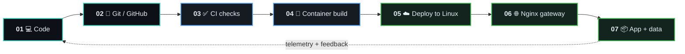

<!--
  Profile README: DevOps / Platform Engineer edition
  Replace @i6nake9 links only if your GitHub username changes.
  The <details> terminal, animated SVG, and Mermaid diagrams are GitHub-safe Markdown/HTML.
-->

<div align="center">

<!-- HERO: custom animated terminal-like SVG, rendered directly by GitHub -->
<a href="https://github.com/i6nake9">
  
</a>

<p>
  <a href="https://artembielov.com/"></a>
  <a href="https://github.com/i6nake9"></a>
  
</p>

</div>

<!-- Animated scanline divider -->
<p align="center">
  
</p>

## `~/identity` 

<table>
<tr>
<td width="58%" valign="top">

```bash
artem@production:~$ cat profile.yaml

name: Artem Bielov
location: Poland / Ukraine
role: DevOps-minded Full-Stack & Platform Engineer
motto: "Build it. Run it. Improve it."

mission:
  - Turn ideas into deployable products
  - Make releases predictable and repeatable
  - Replace fragile manual routines with automation
  - Build infrastructure that makes business move faster
```

</td>
<td width="42%" valign="top">

### Signal, not noise

I am a hands-on builder who works across the full delivery path—from application code to Linux servers, containers, reverse proxies, databases, and production operations.

Running product and e-commerce ventures taught me that a system is only useful when it is **reliable, maintainable, measurable, and cost-conscious**.

</td>
</tr>
</table>

<details>
<summary><b>▸ Open the production mindset</b></summary>
<br/>

```diff
+ Automate repeatable work.
+ Version infrastructure and deployment knowledge.
+ Design every service as something you may need to debug at 03:00.
+ Measure before optimizing.
- "It works on my machine" is not a deployment strategy.
```

</details>

## `~/delivery-pipeline`

<div align="center">

```text
┌──────────┐      ┌──────────────┐      ┌──────────────┐      ┌────────────────┐      ┌─────────────┐
│  WRITE   │ ───▶ │   VALIDATE   │ ───▶ │   PACKAGE    │ ───▶ │    RELEASE     │ ───▶ │   OBSERVE   │
│ code/ops │      │ lint/test/CI │      │ Docker image │      │ Linux + Nginx  │      │ logs/health │
└──────────┘      └──────────────┘      └──────────────┘      └────────────────┘      └──────┬──────┘
     ▲                                                                                          │
     └────────────────────────────── feedback → automate → improve ────────────────────────────┘
```

</div>



## `~/stack --grouped`

<table>
<tr>
<td width="33%" valign="top">

### ☁️ Platform & Ops

<p>

</p>

`Linux` `Docker` `CI/CD` `Nginx`  
`Cloud` `Bash` `PowerShell` `Git`

</td>
<td width="33%" valign="top">

### 🧠 Services & Data

<p>

</p>

`Node.js` `NestJS` `TypeScript`  
`Rust` `PostgreSQL` `Redis`

</td>
<td width="33%" valign="top">

### 🎨 Product Layer

<p>

</p>

`Next.js` `React` `Shopify`  
`Tailwind` `Headless commerce`

</td>
</tr>
</table>

## `~/now`

<div align="center">

```text
╭──────────────────────────── CURRENT QUESTS ────────────────────────────╮
│                                                                         │
│  [████████░░]  Rust & systems programming                               │
│  [██████░░░░]  Kubernetes / cloud-native architecture                   │
│  [██████░░░░]  Infrastructure as Code                                   │
│  [███████░░░]  Observability, security & production operations          │
│                                                                         │
╰─────────────────────────────────────────────────────────────────────────╯
```

</div>

| Beacon | Current trajectory |
|:--|:--|
| `⚡ BUILD` | E-commerce and web products with an automation-first architecture |
| `🐳 OPERATE` | Containerized services, Linux deployments, reverse proxies, databases |
| `🦀 LEARN` | Rust, systems/embedded engineering, platform engineering practices |
| `🔭 EXPLORE` | IaC, Kubernetes, observability, resilient cloud-native delivery |

## `~/telemetry`

<div align="center">

<a href="https://github.com/i6nake9">
  
</a>
<a href="https://github.com/i6nake9">
  
</a>

<br/>


</div>

## `~/connect`

<div align="center">

<a href="https://artembielov.com/"></a>
<a href="https://dev.to/i6nake9"></a>
<a href="https://twitter.com/i6nake9"></a>
<a href="mailto:fleshartemka@gmail.com"></a>

<br/><br/>

<sub>"If opportunities do not knock, build a door — then automate the deployment."</sub>

</div>

<!--
  OPTIONAL PREMIUM VISUAL:
  This requires a GitHub Actions workflow in your profile repository.
  Once configured, it animates your real contribution graph as a snake.

  <picture>
    <source media="(prefers-color-scheme: dark)" srcset="https://raw.githubusercontent.com/i6nake9/i6nake9/output/github-contribution-grid-snake-dark.svg" />
    <source media="(prefers-color-scheme: light)" srcset="https://raw.githubusercontent.com/i6nake9/i6nake9/output/github-contribution-grid-snake.svg" />
    
  </picture>
-->

<p align="center">
  
  <br/>
  <code>system.status = "BUILDING · SHIPPING · AUTOMATING"</code>
</p>
