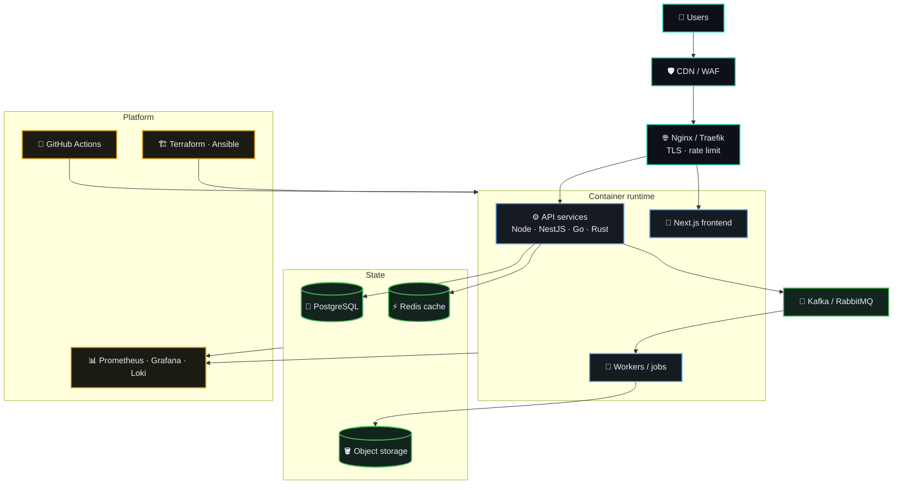

```mermaid
flowchart LR
    classDef source  fill:#0d1117,stroke:#35D0BA,color:#e6edf3,stroke-width:2px
    classDef process fill:#161b22,stroke:#58A6FF,color:#e6edf3,stroke-width:2px
    classDef live    fill:#13231e,stroke:#3FB950,color:#e6edf3,stroke-width:2px
    classDef watch   fill:#1c1b13,stroke:#D29922,color:#e6edf3,stroke-width:2px

    A["<b>01</b> 💻 Code"]:::source --> B["<b>02</b> 🔀 Git / GitHub"]:::source
    B --> C["<b>03</b> ✅ CI: lint · test · scan"]:::process
    C --> D["<b>04</b> 🐳 Build image"]:::process
    D --> E["<b>05</b> 📦 Registry"]:::process
    E --> F["<b>06</b> ☁️ Deploy: Linux / K8s"]:::live
    F --> G["<b>07</b> 🌐 Nginx · TLS · routing"]:::live
    G --> H["<b>08</b> 🗄️ App + data layer"]:::live
    H --> I["<b>09</b> 🔭 Metrics · logs · alerts"]:::watch
    I -. "telemetry + feedback" .-> A
```

<!--
  ────────────────────────────────────────────────────────────────────────────
  Profile README — Artem Bielov (@i6nake9)
  DevOps / Platform Engineer — cinematic terminal edition v2
  All visuals are GitHub-safe (Markdown + allowed HTML + external SVG services).
  Replace "i6nake9" everywhere if the GitHub username changes.
  ────────────────────────────────────────────────────────────────────────────
-->

<div align="center">

<!-- ANIMATED WAVE HEADER -->


<!-- ANIMATED TYPING HEADLINE -->
<a href="https://artembielov.com/">
  
</a>

<p>
  <a href="https://artembielov.com/"></a>
  <a href="https://github.com/i6nake9"></a>
  <a href="mailto:fleshartemka@gmail.com"></a>
  
</p>

<p>
  <a href="https://artembielov.com/"></a>
  <a href="https://dev.to/i6nake9"></a>
  <a href="https://twitter.com/i6nake9"></a>
  <a href="mailto:fleshartemka@gmail.com"></a>
</p>


</div>

## `~/identity`

<table>
<tr>
<td width="56%" valign="top">

```yaml
artem@production:~$ cat profile.yaml

name:      Artem Bielov
handle:    "@i6nake9"
location:  Poland / Ukraine
role:      DevOps-minded Platform & Full-Stack Engineer
motto:     "Build it. Run it. Improve it."

mission:
  - turn ideas into deployable products
  - make releases predictable and repeatable
  - replace fragile manual routines with automation
  - build infrastructure that makes business move faster

focus_2026:
  - rust & systems programming
  - kubernetes / cloud-native architecture
  - infrastructure as code
  - observability, security, production ops
```

</td>
<td width="44%" valign="top">

### Signal, not noise

I am a hands-on builder who works across the **full delivery path** — from application code to Linux servers, containers, reverse proxies, databases and production operations.

Running product and e-commerce ventures taught me that a system is only useful when it is **reliable, maintainable, measurable and cost-conscious**.


</td>
</tr>
</table>

<details>
<summary><b>▸ Open the production mindset</b></summary>
<br/>

```diff
+ Automate repeatable work — twice done manually means it should be scripted.
+ Version infrastructure and deployment knowledge, not only application code.
+ Design every service as something you may need to debug at 03:00.
+ Measure before optimizing: metrics, logs, traces, then decisions.
+ Security and cost are architecture properties, not afterthoughts.
- "It works on my machine" is not a deployment strategy.
- Snowflake servers configured by hand and remembered by nobody.
```

</details>

<div align="center">

</div>

## `~/delivery-pipeline`

<div align="center">

```text
┌──────────┐    ┌──────────────┐    ┌──────────────┐    ┌────────────────┐    ┌─────────────┐
│  WRITE   │ ──▶│   VALIDATE   │ ──▶│   PACKAGE    │ ──▶│    RELEASE     │ ──▶│   OBSERVE   │
│ code/ops │    │ lint/test/CI │    │ Docker image │    │ Linux + Nginx  │    │ logs/health │
└──────────┘    └──────────────┘    └──────────────┘    └────────────────┘    └──────┬──────┘
     ▲                                                                                │
     └───────────────────────── feedback → automate → improve ────────────────────────┘
```

</div>



<details>
<summary><b>▸ Reference architecture I like to run</b></summary>
<br/>



</details>

<div align="center">

</div>

## `~/stack --all --grouped`

<div align="center">

### ☁️ &nbsp;Cloud, Platform & Operations


<p>


</p>

### 🧠 &nbsp;Languages


<p>


</p>

### ⚙️ &nbsp;Backend, Services & APIs


<p>


</p>

### 🗄️ &nbsp;Data, Storage & Caching


<p>


</p>

### 📨 &nbsp;Message Brokers, Streaming & Async


<p>


</p>

### 🔭 &nbsp;Observability, Security & Reliability


<p>


</p>

### 🎨 &nbsp;Product & Frontend Layer


<p>


</p>

### 🧪 &nbsp;Testing, Quality & Developer Experience


<p>


</p>


</div>

## `~/now --progress`

<div align="center">

```text
╭───────────────────────────── CURRENT QUESTS ──────────────────────────────╮
│                                                                           │
│  Rust & systems programming              [████████░░]  80%                │
│  Kubernetes / cloud-native architecture  [███████░░░]  70%                │
│  Infrastructure as Code (TF + Ansible)   [███████░░░]  70%                │
│  Observability & SRE practices           [████████░░]  75%                │
│  Platform security & hardening           [██████░░░░]  60%                │
│  Cost-aware cloud architecture           [█████░░░░░]  55%                │
│                                                                           │
╰───────────────────────────────────────────────────────────────────────────╯
```

</div>

| Beacon | Current trajectory |
|:--|:--|
| `⚡ BUILD` | E-commerce and web products with an automation-first architecture |
| `🐳 OPERATE` | Containerized services, Linux deployments, reverse proxies, databases |
| `🦀 LEARN` | Rust, systems / embedded engineering, platform engineering practices |
| `🔭 EXPLORE` | IaC, Kubernetes, observability, resilient cloud-native delivery |
| `🤝 OPEN TO` | DevOps / SRE / Platform Engineer roles · remote or Poland-based |

<div align="center">

</div>

## `~/telemetry`

<div align="center">

<a href="https://github.com/i6nake9">
  
</a>
<a href="https://github.com/i6nake9">
  
</a>

<br/>


<br/><br/>

<!-- ANIMATED CONTRIBUTION ACTIVITY GRAPH -->


<br/>


</div>

<details>
<summary><b>▸ Deep telemetry (extra cards)</b></summary>
<br/>
<div align="center">


<br/>


</div>
</details>

<!--
  ANIMATED CONTRIBUTION SNAKE
  Works after you add the workflow file: .github/workflows/snake.yml
  (see snake.yml shipped together with this README)
  Then uncomment the block below.

<div align="center">
  <picture>
    <source media="(prefers-color-scheme: dark)" srcset="https://raw.githubusercontent.com/i6nake9/i6nake9/output/github-contribution-grid-snake-dark.svg" />
    <source media="(prefers-color-scheme: light)" srcset="https://raw.githubusercontent.com/i6nake9/i6nake9/output/github-contribution-grid-snake.svg" />
    
  </picture>
</div>
-->

<div align="center">

</div>

## `~/connect`

<div align="center">

<a href="https://artembielov.com/"></a>
<a href="https://dev.to/i6nake9"></a>
<a href="https://twitter.com/i6nake9"></a>
<a href="mailto:fleshartemka@gmail.com"></a>

<br/><br/>


<code>system.status = "BUILDING · SHIPPING · AUTOMATING"</code>

</div>
